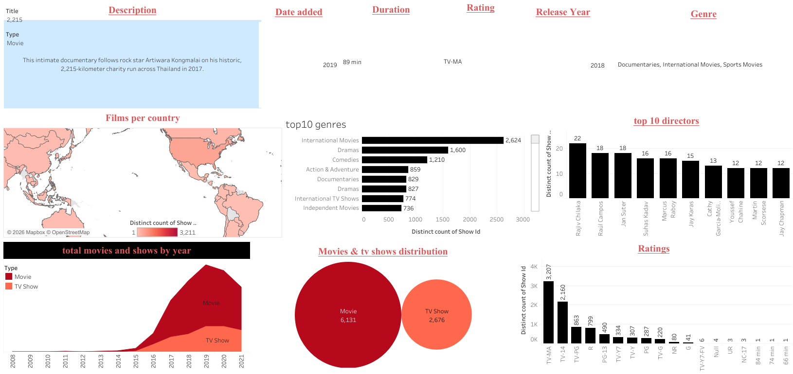

## 📌 Project Overview

This project explores the Netflix Titles dataset using a complete data analysis workflow. The objective was to clean and normalize the data, perform SQL analysis to uncover insights, and create interactive visualizations.

## 🛠 Tools Used
Microsoft Excel / Spreadsheets – Data cleaning and normalization
MySQL – Data storage, transformation, and analysis
Tableau Public – Dashboard creation and visualization
GitHub – Project documentation and portfolio presentation

## 📂 Dataset 

Dataset: [Netflix Titles Dataset](https://github.com/dolar-ken/netflix-data-analysis-dashboard/blob/main/netflix_titles%20_original.csv)

The dataset contains information about Netflix content, including:

- Show ID 
- Title
- Director(s) 
- Cast
- Country
- Date Added
- Release Year 
- Rating
- Duration 
- Genre (Listed In)
- Type (Movie or TV Show)

## 🔹 Data Cleaning Process
###  1. Missing Value Analysis

The first step involved identifying missing values within the dataset.

SQL queries were written to:

Count blank directors
Count blank countries
Count blank ratings
Count blank dates added
Identify other incomplete records

This helped determine the quality of the dataset before analysis.

## 🔹 Data Normalization

Several columns contained multiple values separated by commas.

Examples:

Original Column
- Director
- Country
- Listed In (Genres)

To improve data structure and querying efficiency, these columns were normalized.

Spreadsheet Transformation

The comma-separated values were split into individual columns using spreadsheet functions.
<a href="https://github.com/dolar-ken/netflix-data-analysis-dashboard/commit/ef9e86b19955e388aac21369b0ec3c9783d77d73"> normalised tables </a>

## MySQL Transformation

The normalized spreadsheet tables were imported into MySQL.

Using UNION ALL, multiple director, country, and genre columns were converted into two-column relational tables. 
Example structure:

Genres Table
- show_id	  genre
- s1	       Drama
- s1	       Comedy
- s2    	   Action

## 🔹 Exploratory Data Analysis (EDA)

SQL was used to answer business questions and generate insights.

Some analyses included:

#### Content Distribution
Total Movies vs TV Shows
#### Content released over time
Content ratings distribution
#### Director Analysis
Top 10 directors by number of Netflix titles
#### Geographic Analysis
Content production by country
#### Genre Analysis
Most common Netflix genres
#### Rating Analysis
Most frequently assigned content ratings

the query can be accessed here <a href="https://github.com/dolar-ken/netflix-data-analysis-dashboard/blob/main/netflix%20films%20query.sql"> sql queries </a>

## 📊 Tableau Dashboard

An interactive dashboard was created in Tableau to visualize the findings.

### Dashboard Components
🌍 Content by Country Map

Interactive world map showing Netflix content distribution by country.

### 📈 Top 10 Directors

Bar chart displaying directors with the highest number of titles on Netflix.

### ⭐ Ratings Distribution

Bar chart showing the most common content ratings.

### 🔵 Movies vs TV Shows

Circle chart comparing the number of Movies and TV Shows.

### 🎬 Total Movies by Release Year

Trend visualization showing how movie releases changed over time.

## 🔍 Key Insights

### Some notable findings include:

Movies make up the majority of Netflix content.
- A small number of directors contribute a significant number of titles.
- Certain ratings dominate the Netflix catalog.
- Content production has increased significantly over recent years.
- Netflix content is concentrated in a few major production countries.

  ## 🚀 Project Outcome

### This project demonstrates practical skills in:

- Data Cleaning
- Data Normalization
- SQL Querying
- Relational Database Design
- Exploratory Data Analysis
- Data Visualization
- Dashboard Development
- GitHub Project Documentation

The project follows an end-to-end data analysis workflow, transforming raw Netflix data into actionable insights through SQL and Tableau.

## Dashboard Preview

## Author

Francis Orembe
Aspiring Data Analyst | SQL | Excel | Tableau | Power BI
